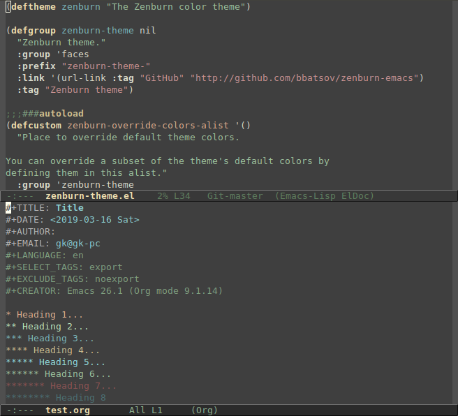
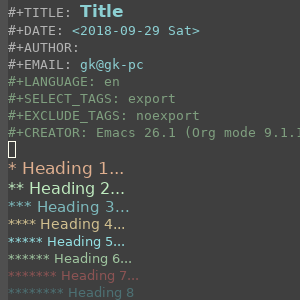

# zenburn-theme for Emacs

[![License GPL 3][badge-license]](http://www.gnu.org/licenses/gpl-3.0.txt)
[](http://melpa.org/#/zenburn-theme)
[](http://stable.melpa.org/#/zenburn-theme)

## About

Zenburn for Emacs is a direct port of the popular
[Zenburn](http://kippura.org/zenburnpage/) theme for vim,
developed by [Jani Nurminen](https://github.com/jnurmine). It's my personal belief (and
that of its many users I presume) that it's one of the best low
contrast color themes out there and that it is exceptionally easy on
the eyes.

This theme uses the "new" (it used to be new several years ago when I
created this package) built-in theming support available starting with
Emacs 24.1.



------------
[](https://ko-fi.com/C0C2204SR)
[](https://www.patreon.com/bbatsov)

You can support the development of Zenburn for Emacs via
[GitHub Sponsors](https://github.com/sponsors/bbatsov),
[ko-fi](https://ko-fi.com/bbatsov),
[PayPal](https://www.paypal.me/bbatsov) and
[Patreon](https://www.patreon.com/bbatsov).

## Installation

### Manual

Download `zenburn-theme.el` to the directory `~/.emacs.d/themes/`. Add this to your
`.emacs` (or `init.el`):

```lisp
(add-to-list 'custom-theme-load-path "~/.emacs.d/themes/")
```

Now you can load the theme with the interactive function `load-theme` like this:

`M-x load-theme RET zenburn`

### Package.el

Zenburn is available in both [MELPA Stable](http://stable.melpa.org)
and [MELPA](http://melpa.org).

You can install `zenburn` with the following command:

`M-x package-install zenburn-theme`

To load it automatically on Emacs startup add this to your init file:

```lisp
(load-theme 'zenburn t)
```

### Emacs Prelude

Zenburn for Emacs is already bundled into
[Emacs Prelude](https://github.com/bbatsov/prelude). If you're a
Prelude user - you're probably already using Zenburn, since it's
Prelude's default color theme. You can load Zenburn at any time by
`M-x load-theme zenburn`.

### Debian and Ubuntu

Users of Debian 9 or later or Ubuntu 16.10 or later may simply
`apt-get install elpa-zenburn-theme`.

## Customization

### Custom colors

If you'd like to tweak the theme by changing just a few colors, you can
do so by defining new values in the `zenburn-override-colors-alist`
variable before loading the theme.

For example, to customize just the lighter background colors, you could add
to your init file:

```elisp
(setq zenburn-override-colors-alist
      '(("zenburn-bg+05" . "#282828")
        ("zenburn-bg+1"  . "#2F2F2F")
        ("zenburn-bg+2"  . "#3F3F3F")
        ("zenburn-bg+3"  . "#4F4F4F")))
(load-theme 'zenburn t)
```

To see the full list of color names you can override, consult the
`zenburn-theme.el` source file.

### Scaled headings

The theme supports scaling the font size for some headings and titles as well
as using a variable-pitch font for those. To enable this, use the following
settings **before** loading `zenburn-theme`:

```elisp
;; use variable-pitch fonts for some headings and titles
(setq zenburn-use-variable-pitch t)

;; scale headings in org-mode
(setq zenburn-scale-org-headlines t)

;; scale headings in outline-mode
(setq zenburn-scale-outline-headlines t)
```

The screenshot above shows the default setting with no scaled or
variable-pitch fonts. With scaled headings and variable-pitch fonts it looks
like this:



## FAQ

### Wrong colors in the terminal Emacs version

If your Emacs looks considerably uglier in a terminal (compared to the
GUI version) try adding this to your `.bashrc` or `.zshrc`:

```bash
export TERM=xterm-256color
```

Source the `.bashrc` (or `.zshrc`) file and start Emacs again.

## Bugs & Improvements

Please, report any problems that you find on the project's integrated
issue tracker. If you've added some improvements and you want them
included upstream don't hesitate to send me a patch or even better - a
GitHub pull request. [These](https://github.com/bbatsov/zenburn-emacs/contributors)
contributors have done so.

## Donate

You can support my work on Zenburn and [all my other projects](https://github.com/bbatsov)
via
[GitHub Sponsors](https://github.com/sponsors/bbatsov),
[ko-fi](https://ko-fi.com/bbatsov),
[PayPal](https://www.paypal.me/bbatsov) and
[Patreon](https://www.patreon.com/bbatsov).
.

## Contributors

Here's a [list](https://github.com/bbatsov/zenburn-emacs/contributors) of all the people who have contributed to the
development of Zenburn for Emacs.

## Changelog

A fairly extensive changelog is available [here](CHANGELOG.md).

## License

Copyright © 2010-2020 Bozhidar Batsov and
[contributors](https://github.com/bbatsov/zenburn-emacs/contributors).

Distributed under the GNU General Public License, version 3

[badge-license]: https://img.shields.io/badge/license-GPL_3-green.svg
